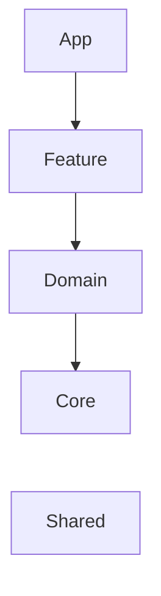

# Fake_2024
- 2024년에 적용한 구조를 볼수있는 예시용 프로젝트입니다.
- App Store 검색 / 상세 페이지 을 보기용으로 구축합니다.

# 목표
- 2024년동안 업무 또는 개인적으로 적용 및 이해한 구조를 반영한 프로젝트를 생성합니다.
- 현재의 개발 방향을 보여줄 수 있도록 합니다.

# Branch Rule
### Trunk Based Development
- Trunk Based Developement(TBD)([링크](https://trunkbaseddevelopment.com/trunk1c.png))를 채택합니다.

### Feature Flag
- 피쳐플래그 예시 보러 가기

# Layer

# 아키텍처
### Clean Architecture
- Presentation -> Domain <- Data 형태를 사용합니다. [(링크)](https://bitloops.com/docs/bitloops-language/learning/software-architecture/clean-architecture)

추가 설명

- 
- 클린아키텍처 그림 34.8
  - Layer 방식
  - 가장 마지막 방식을 사용합니다.
  - App -> Feature(Controller) -> Domain (Domain + Data) -> Core

### TMA
- The Modular Architecture (TMA)[(링크)](https://docs.tuist.dev/en/guides/develop/projects/tma-architecture)를 지향합니다.

# CI/CD
### CI(Continuous Integration)
- 지속적 통합을 위해 보기용 작업이 돌아갑니다.
- TBD방식을 채택해 Trunk로 들어가기 위한 PR생성시 빌드+테스트가 실행됩니다.
  - Tuist 기반 build + test를 실행합니다.
  - 관련 작성한 블로그 [보러가기](https://medium.com/@talq44/github-action%EA%B3%BC-self-hosted-runner%EB%A1%9C-ios-build-test%EB%A5%BC-%EB%8F%8C%EB%A6%AC%EB%8A%94-%EA%B1%B0%EA%B8%B0%EC%97%90-tuist%EB%A5%BC-%EA%B3%81%EB%93%A4%EC%9D%B8-ea4af8ace455)

### CD(Continuous Deployment / Continuous delivery)
- 지속적 배포 / 지속적 전달 관련 작업의 설명을 추가합니다.
  - 지속적 배포
    - 언제든지 배포가 가능하도록 하며, 배포를 위한 인적 추가 리소스가 들어가지 않도록 합니다.
    - 주단위 배포가 가능하도록 배포열차 구축을 실시했습니다. (workflow 보러가기)
  - 지속적 전달
    - QA / PM / User가 바로 확인이 가능한 형태를 구축합니다.
  - 실제 작업 코드와 흡사한 형태의 workflow를 참고 가능합니다.
  - 관련 Xcode Cloud + Firebase + Cocoapods 구축 작성한 블로그 [보러가기](https://medium.com/@talq44/xcode-cloud%EB%A5%BC-%EC%82%AC%EC%9A%A9%ED%95%9C-ci-cd-%ED%99%98%EA%B2%BD-%EB%8F%84%EC%9E%85%EA%B8%B0-2-cocoapods-%EC%84%A4%EC%B9%98%EC%99%80-firebase-%EC%97%B0%EA%B2%B0-268f496b17fa)
  - 실제 회사 프로세스에 적용한 프로세스 관련 작성한 블로그 [보러가기](https://medium.com/bejewel/app%ED%8C%80%EC%9D%80-%EC%9D%B4%EB%A0%87%EA%B2%8C-%EC%9D%BC%ED%95%B4%EC%9A%94-4-%EC%9E%90%EB%8F%99%ED%99%94-aka-ci-cd-cbe63c1b0227)

